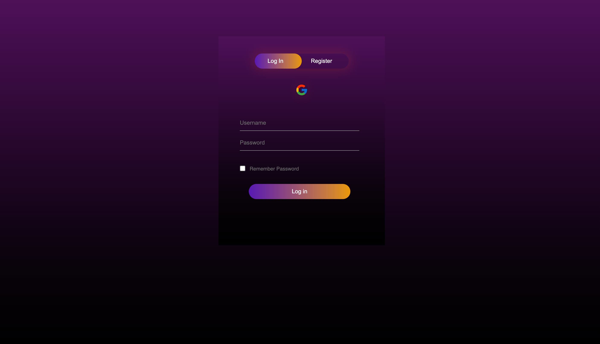
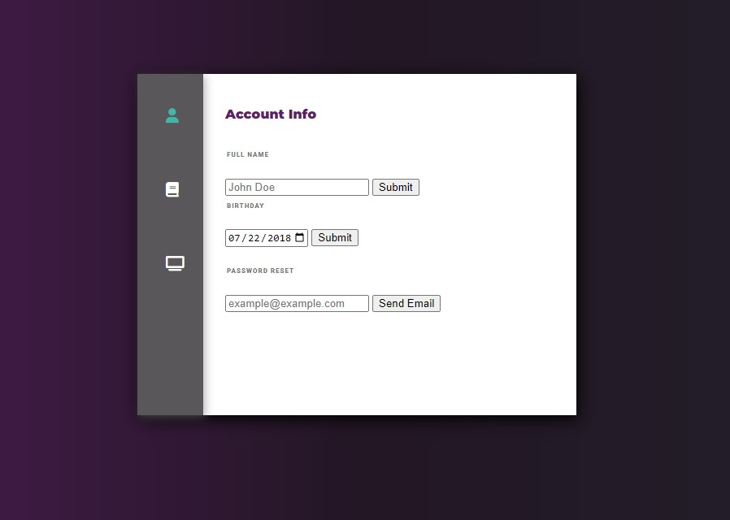

# Project Name: Suggestify

**Note: The website is slow when initial loading because of youtube trailers inside of modal popup.**

## Summary

The project would be an application where users will be able to find a movie or tv show that they would like to watch according to their mood and choice at that time.

## Problem to solve

Oftentimes, people sit down by themselves or with a group of friends, and they end up spending too long trying to find the perfect movie or show to watch by sifting through Google and all of their streaming services. This project would help users quickly find something to watch based on the user’s inputs. The application will be designed to be used by anyone.

## Technologies Used

- Frontend: HTML, CSS, JS, Tailwind CSS, DaisyUI
- Backend: Firebase
- API: TMDB - <https://www.themoviedb.org/documentation/api>


## Installation

### Clone the repository

```text
git clone git@github.com:utk-cs340-fall22/suggestify.github.io.git
```

### Open File

```text
Open index.html in any browser
```

## Hosting

Suggestify is being hosted using GitHub Pages. Visit this URL: <https://utk-cs340-fall22.github.io/suggestify.github.io/>

## Images

### Figma Design


###  Main Page


### Search page


### Watchlist Feature


### Movies Page with Filtering


### Tv Show Page with Filtering


### Spotlight Carousel


### Login Page


### Settings Page



## Presentation slides

[Demo Slides](SuggestifyDemo.pdf)

## Contributors (Name & Github ID)

- Riya Patel - rpatel90
- Manan Patel - manan-dev
- Tulsi Tailor - ttulsi01
- Zachary Perry - zperry4
- Christian Graham - cgraha37

## License

Suggestify is available under the MIT license. See the [LICENSE](https://github.com/utk-cs340-fall22/suggestify.github.io/blob/main/LICENSE) for more info
